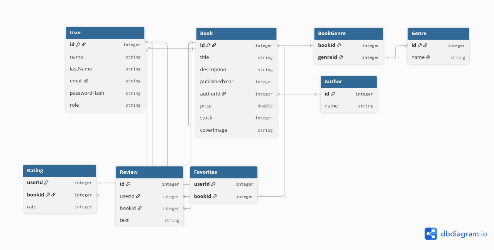

# Database Schema
## Overview

The database is designed to support the main features of the Book Store application, including users, books, authors, genres, ratings, reviews, and favorites. The schema uses relational database principles and separates entities into individual tables. Many-to-many relationships are handled using junction tables.
## Main Entities
### User

Stores registered user information.
A user can:
- Rate multiple books
- Write multiple reviews
- Add multiple books to favorites

### Book

Stores information about books. 
Each book:
- Has one author
- Can belong to multiple genres
- Can receive multiple ratings
- Can receive multiple reviews
- Can be added to favorites by multiple users

### Author

Stores book authors. 
Currently, each book is associated with one author. 

### Genre

Stores book genres. 
A book can belong to multiple genres, and a genre can contain multiple books.

### Rating

Connects users and books.
A user can rate multiple books, and a book can receive ratings from multiple users. 

### Review

Stores reviews written by users about books. 
A user can write multiple reviews, and a book can have multiple reviews. 

### Favorites

Connects users and books. 
A user can add multiple books to favorites, and a book can be added to favorites by multiple users. 

## Relationships 

- User → Rating: One-to-Many 
- Book → Rating: One-to-Many
- User → Review: One-to-Many
- Book → Review: One-to-Many
- User ↔ Book: Many-to-Many through Favorites 
- Book ↔ Genre: Many-to-Many through BookGenre
- Author → Book: One-to-Many

## Database Diagram

